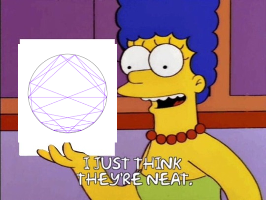

# fibonacci-art

## Concept

I saw this [YouTube Video about visualizing Fibonacci numbers](https://youtu.be/o1eLKODSCqw) and I thought the designs were really neat.

I also wanted to learn some go since it's also neat.
When I found  [fogleman's gg 2d rendering library in go](https://github.com/fogleman/gg) that was that.

Origin story complete.

## Usage

`fibonacci-art` is a command line utility to generate images based on pisano periods of fibonacci numbers as well as utilities for generating those pisano periods. 

Examples of output can be found in [the examples directory](./examples) with the commands to generate them supplied in the [commands.txt](./examples/commands.txt) file.
